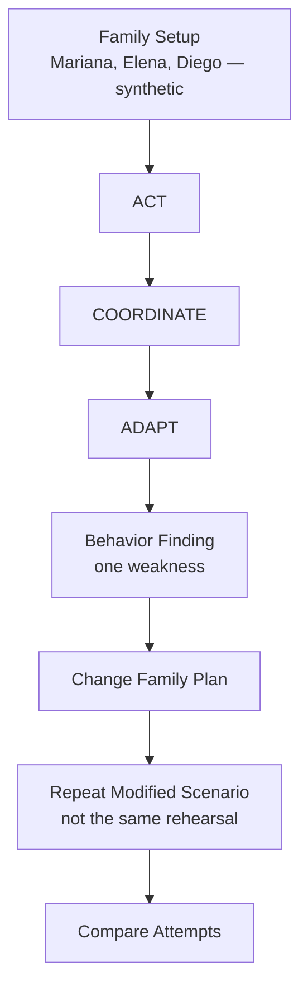
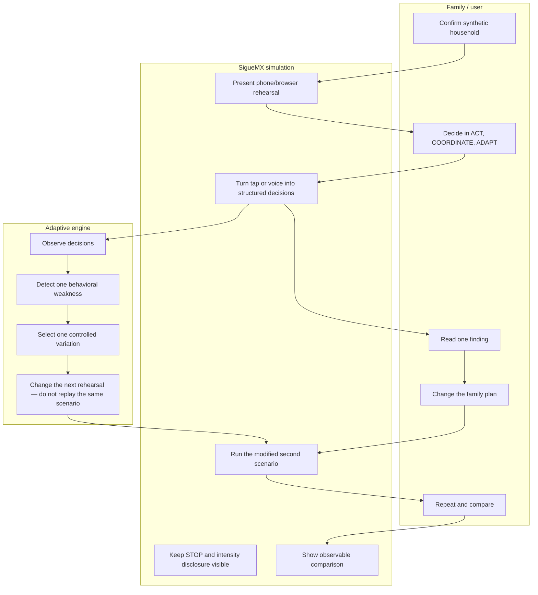
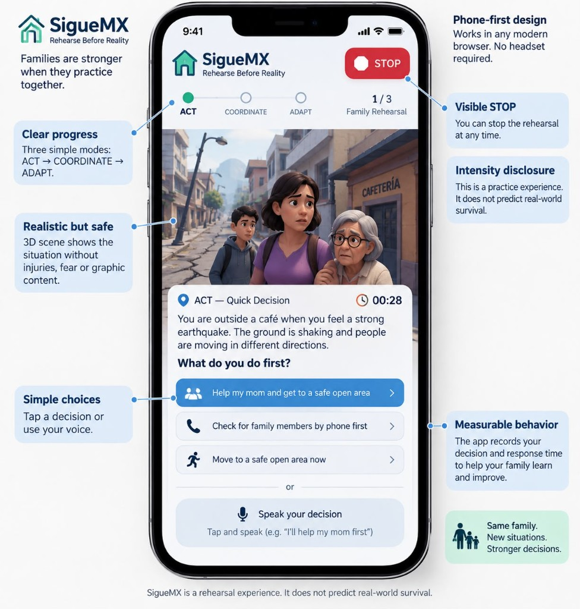

# SigueMX packet

Week 6  
Prototype: **SigueMX — Rehearse Before Reality**  
This is a NEW project. It does not modify or reuse the Week 5 repository.

Project setup (React + Vite + TypeScript, Three.js, placeholder folders) is already in this repository. Product functionality is not implemented yet.

---

## 1. Title / One-liner

SigueMX — Rehearse Before Reality.

---

## 2. Problem

Mexican families may participate in institutional earthquake drills but still have decisions they have never rehearsed together, particularly when they are separated, a vulnerable member needs help, or the expected plan fails.

---

## 3. Exact user

A fictional Mexican family with a vulnerable member. All names and details below are **synthetic / invented for demonstration only**. They are not real people. The product must work on a normal phone/browser without requiring a headset.

### Demo family (synthetic)

| Name | Age | Role | Notes |
|---|---|---|---|
| **Mariana** | 46 | Mother and family coordinator | Usual person others wait for. Synthetic. |
| **Elena** | 72 | Grandmother who may need assistance | Vulnerable member. Synthetic. |
| **Diego** | 15 | Son | Synthetic. |

Persona test user (when testing begins; also fictional): **Doña Mari**, 54, sells food outside the metro, uses WhatsApp but distrusts unfamiliar apps, reads slowly and gives up silently when confused. Doña Mari is the tester persona, not a fourth household member in the rehearsal.

---

## 4. Primary vacuum

Family Rehearsal.

---

## 5. Required capability

Behavior Measurement.

---

## 6. Success definition

Before the MVP closes, a user can complete **ACT**, **COORDINATE** and **ADAPT**, receive one concrete behavioral finding, change the family plan, repeat a modified scenario, and see an observable comparison between attempts.

---

## 7. Core loop

Experience → Decision → Detection → Adaptation → Repeat.

---

## 8. Three modes

- **ACT:** Make an immediate decision under controlled uncertainty.
- **COORDINATE:** Family members are separated and must act without relying on the normal family coordinator (Mariana).
- **ADAPT:** The expected plan changes because communication fails **OR** the meeting point becomes unavailable.

---

## 9. Blueprint conditions

1. Measure decisions, not fear.
2. Include uncertainty in rehearsal.
3. Accessibility before maximum immersion; phone/browser first, optional VR/WebXR.
4. The experience must be repeatable: rehearse, discover weakness, change plan, repeat.
5. Never claim simulated performance equals real-world survival.

---

## 10. Dragon Stack

1. Three.js/browser simulation creates the experience.
2. Constrained adaptive logic detects one weakness and changes the next rehearsal.
3. Browser voice input becomes structured decision data.

The technologies must interact, not exist as separate demos.

Approved implementation notes already in the repo: React + Vite + TypeScript; `three`; later, browser Web Speech API and a constrained rules-based adaptive engine. No React Three Fiber, speech SDK, or AI API was added at setup.

---

## 11. Adaptive rule

Observe decision → detect **one** meaningful weakness → select **one** controlled variation → change the next rehearsal → compare behavior.

The repeat is **not** a replay of the same scenario. The adaptive engine must alter the next rehearsal so the family faces a different constrained condition tied to the finding (for example: coordinator unavailable, meeting point blocked, or communication failed). Only one finding and one variation at a time.

This rule is specified here. It is **not** implemented in application code yet.

---

## 12. Measurement

Track decisions, response time, responsibility without prompting, plan consistency, adaptation, repeated errors and improvement across rehearsals.

Do not create a universal preparedness or survival score.

---

## 13. Shadow clause

“Manufacture the decision, not the trauma.”

Never use photorealistic injuries, dead relatives, personalized tragedy, surprise real-person likenesses, fear scoring or emotional intensity as a success metric. Disclose intensity and keep **STOP** visible.

---

## 14. Global benchmark

Rikei + Daiwa LifeNext’s VR Earthquake Drill in Japan demonstrates repeatable earthquake rehearsal with smartphone access. SigueMX differs by focusing on Mexican family responsibilities, three constrained decision modes, behavior comparison and an adaptive repeat loop.

Cite: https://www.rikei.co.jp/en/news/2024-04/

---

## 15. Scope cut

**In**

- One fictional family (Mariana, Elena, Diego — synthetic)
- Three modes
- One controlled adaptive loop
- One important finding at a time

**Out**

- Alert system
- Information encyclopedia
- Full VR platform
- Certification
- Insurance pricing
- Survival prediction

---

## 16. Architecture

- React + Vite + TypeScript
- Three.js
- Browser Web Speech API
- Constrained rules-based adaptive engine
- Vercel and GitHub
- Supabase only if persistent data is genuinely required; if storing personal data, require authentication and RLS

---

## 17. Security floor

- No secrets in source code.
- Validate inputs.
- Use invented demo data only (this household is synthetic).
- Keep API keys in environment variables if introduced.

---

## 18. Test plan

**Mechanical test:** phone viewport, three modes, tap, supported voice input, response time, adaptive variation, repeat, refresh/session behavior, STOP and invalid input. Find a real bug, document cause, fix, redeploy and verify.

Confirm on mechanical test that the second attempt is a **modified** scenario, not an identical replay.

**Persona test:** Doña Mari, 54, sells food outside the metro, uses WhatsApp but distrusts unfamiliar apps, reads slowly and gives up silently when confused. Test through screenshots in a fresh conversation; document hesitation and fix the worst usability issue.

---

## 19. Deployment

At least two deployments and five meaningful commits.

---

## 20. Three-year view

The first product rehearses three family decisions in a browser. Over three years, validated scenario variations could support additional locally relevant risks without generating unlimited disasters. Any broader claims about real-world outcomes would require separate evidence.

---

## 21. Flowchart

Family Setup → ACT → COORDINATE → ADAPT → Behavior Finding → Change Family Plan → Repeat Modified Scenario → Compare Attempts.

---

## 22. Swimlane

Responsibilities of Family/user, SigueMX simulation, and Adaptive engine. The engine detects one behavioral weakness and changes the next rehearsal.

---

## 23. Visual artifacts

Approved Week 6 image-generated mockup (phone-first ACT rehearsal, visible STOP, intensity disclosure, tap or voice choices). File: `docs/mockup-siguemx.png`.

| Artifact | Status |
|---|---|
| Image-generated mockup | Present: `./mockup-siguemx.png` |
| Mermaid flowchart | Present in this packet (section 21) |
| Mermaid swimlane | Present in this packet (section 22) |

---

## 24. Current repo status

Phone-first welcome and synthetic family setup are implemented. ACT, COORDINATE, ADAPT, adaptive logic, voice input, measurement runtime, and the 3D rehearsal are not implemented.

---

## 25. Next move

See `docs/DECISIONS.md`.
